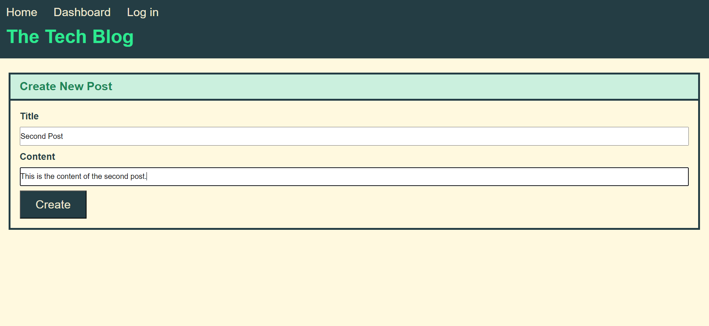

# Tech Blog

## Description
This great application can be useful to everyone interested in reading and writing about new technologies.  
It allows users to create, edit and delete posts and, most importantly, leave comments.  
The tech community is big; collaborations and interactions allow us to learn and tech.

## Installation

To use the application first run "npm i".  
After everything is installed run "mysql -u (your username) -p and enter your password.  
Run "source schema.sql" to create a database.  
And then run "npm run seed" to populate the tables.  
In the end, just run "npm start" to start the application.

## Usage

To use Tech Blog you can click on the link below:

[Tech Blog - Sonja Gorin](https://technology-blog-sg-b51f56d78026.herokuapp.com/)

Preview:

## License
Please refer to the LICENSE in the repo.
